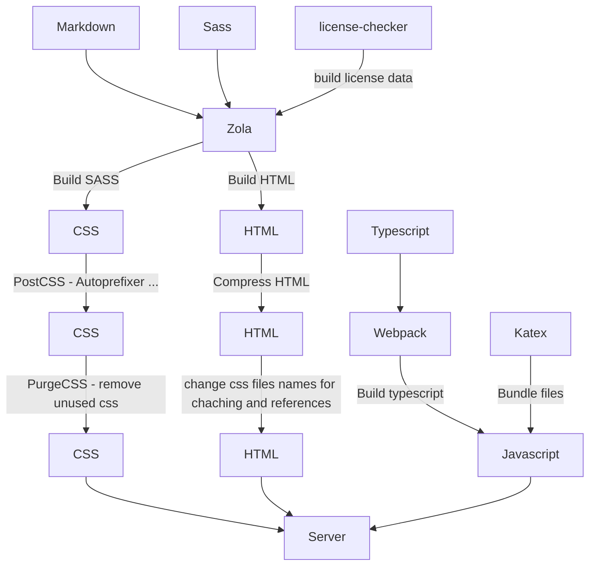

# coderdojo website

TODO:

-   [ ] Fix scrollspy
-   [ ]
-   [x] Fix styling
    -   [x] color -> title …
    -   [ ] active for scrollspy
    -   [x] floating sidebar
-   [x] Fix section links and author notes
-   [ ] Add documentation
-   [ ] Add a flowchart for CI and build

## CD/CI

### Deployment

The deployment is done on each commit (assuming linting job is passing) with rsync over ssh. I've written [a blog article about the used technique](https://cobalt.rocks/blog/rrsync-debian-buster/). The target server is Clover#1 and the server uses a hardened config with a file limit of around 10 GB. Before Deployment the assets will be processed additionally to reduce size and accelerate speed. See belo flow chart for the processing (all details in `package.json`).

### Linting

All theme assets, such as sass and typescript, are linted on every commit that affects them. The deployment to production is dependent on the linting job and thus will not be done if it fails.

> All tools are installed as part of the `devDepencies`

Use tools for linting:

- [ESLint](https://eslint.org/) (config: `.eslintrx.json`) — Linting all files in `ts/`
- [stylelint](https://stylelint.io/) (config: `.stylelintrc.json`) — Linting all files in `sass/`

Used formatters:

- [Prettier](https://github.com/prettier/prettier) (config: `.stylelintrc.json`) — Code formatter for all assetss

