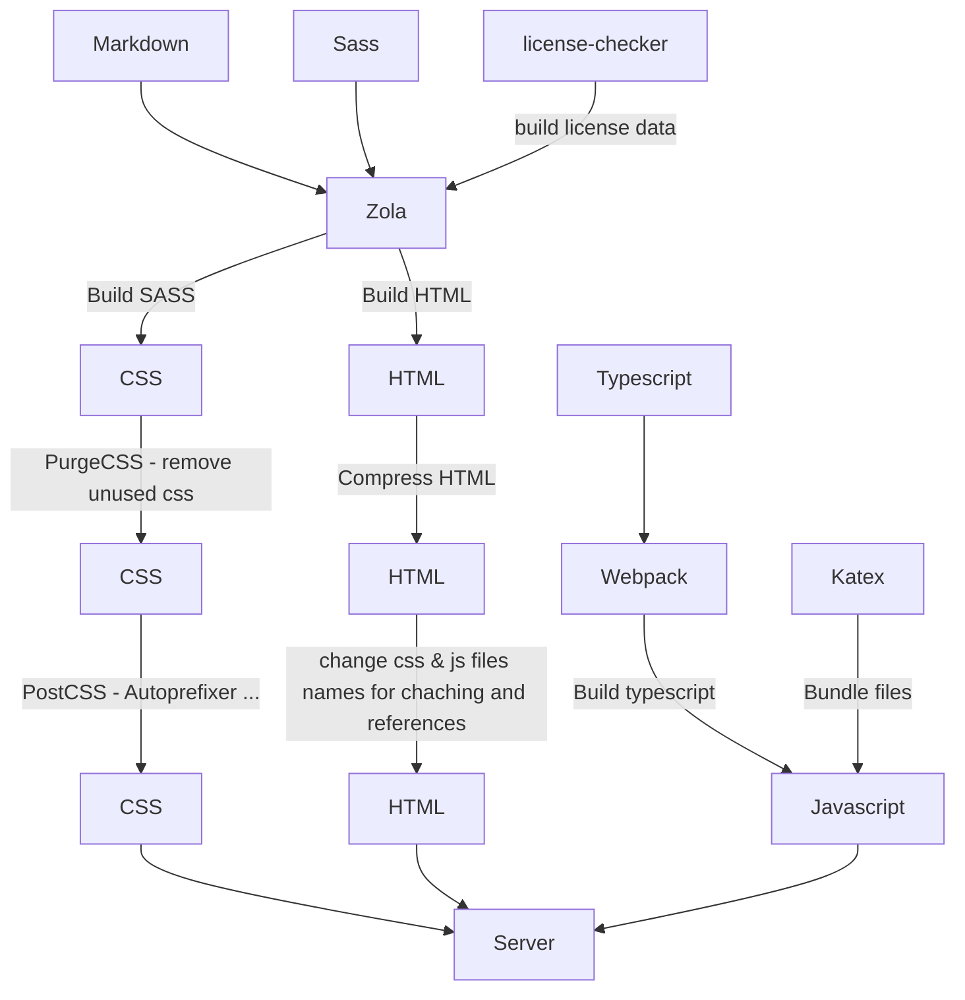

# coderdojo website

DerMicha and Bengoshi's todo:

-   [ ] Add favicon (use [realfavicongenerator](https://realfavicongenerator.net/) and replace relevant tags in `templates/base.html`)
    -   [ ] Replace brand (see `config.toml -> [extra] -> brand_alt; brand_src`)
    -   [ ] replace favicons (replace either icons or locations for `get_url`) (`templates/macros/faivon.html`)
-   [ ] Insert Content
    -   [ ] Chapters (See Add Chapters)
    -   [ ] Privacy policy (no cookies used. Logging of User client and IP for 1 day)
    -   [ ] Imprint information (`content/imprint.md`)
    -   [ ] Contact information (`content/contact.md`)
    -   [ ] Copyright information (`content/copyright.md`)
    -   [ ] Index page (`templates/index.html`)

Cobalt's TODO:

-   [x] Fix scrollspy
-   [x] Fix styling
    -   [x] color -> title …
    -   [x] active for scrollspy
    -   [x] floating sidebar
-   [x] Fix section links and author notes
-   [x] Add documentation
-   [x] Add a flowchart for CI and build
-   [ ] Macro for linking files from static

Things that haven't been added but could be later on:

-   [ ] Search for whole content ([Zola Docs](https://www.getzola.org/documentation/content/search/))
-   [ ] Image compression
-   [ ] Multilingual support ([Zola Docs](https://www.getzola.org/documentation/content/multilingual/))
-   [ ] Feeds for news ([Zola Docs](https://www.getzola.org/documentation/templates/feeds/))

## Writing Content

All content for zola has to be written in commonmark, a markdown-compatible, markup format. [See Zola's docs](https://www.getzola.org/documentation/content/overview/) for more information on the general page and section structure.

### Shortcodes

Zola allows you to define [shortcodes](https://www.getzola.org/documentation/content/shortcodes/) that are accessible as Tera functions inside your document. There's only some simple shortcodes implemented for now, but you're free to extend them anytime.

-   Icon
    -   Syntax: `{{ icon(name: string) }}`
    -   Description: inserts `<i>` tag with icon from [Bootstrap icons](https://icons.getbootstrap.com/)
    -   Example: `{{ icon(icon="alt") }}`
-   Color
    -   Syntax: `text`
    -   Description: inserts `span` tag around text with color set to `color` argument
    -   Example: `Colored Text`
-   Figure
    -   Syntax: `{{ figure(source: string, alt: string, float?: string) }}`
    -   Description: Inserts a [figure](https://getbootstrap.com/docs/5.0/content/figures/) styled with bootstrap into the text. `source` is used as the src for the image and `alt` as the description. You can use the optional `float` argument to define a [floating class](https://getbootstrap.com/docs/5.0/utilities/float/) for the figure (required when text should wrap around figures). It's recommended to insert a floating figure before the desired text and not inside.
    -   Example: `{{ figure(source="/images/blog/pentagame-numbered-colored.svg", float="end", alt="Pentagame board - color-coded by set type") }}`
-   File
    -   Syntax: `{{ file(name: string) }}`
    -   Description: inserts header over codeblocks and allows a file name and adds a copy-to-clipboard button for the code.

````markdown
{{ file(name="page.conf") }}
\```nginx

server {}

\```
````

### Using KaTeX

To enable [KaTeX](https://katex.org) for file you need to add a `katex = true` entry to the `[extra]` section of the front-matter part of a document. This will add a link to KaTeX and an autorender script to the compiled HTML file and enable you to use KaTeX in `$…$` and `$$…$$` blocks within commonmark for math typesetting.

Example:

```markdown
+++
title = "Test"
lang = "en"
summary = "Test"

[extra]
katex = true
+++

Did you know that $2 \in \N$ and

$$
\begin{align}
   a^2 &= b^2+c^2 \\
   a   &= \sqrt{b^2+c^2}
\end{align}
$$

For more supported functions see the [$\KaTeX$ documentation](https://katex.org/docs/supported.html)
```

### Adding new Chapters

All chapters are managed within the `chapters.toml` file at the root of the repository. ATM there are four demo chapters with corresponding markdown files already prepared. To add new chapters create a new section file (`content/{name}/_index.md`), add the new entry to the `chapters.toml` and ensure the color value of the chapter in the file and in the `[extra]` block matchup.

> the color attribute in `[extra]` and in `chapters.toml` are used as identifiers to matchup the sections when building the `base.html` template

## Testing locally

> Only Debian was tested so far for building though this may also work on other GNU/Linux systems as long as commands are run in GNU bash and all required tools are installed.

You need [zola](https://www.getzola.org/documentation/getting-started/installation/), [yarn](https://yarnpkg.com/), [nodejs](https://nodejs.org/en/) and [GNU bash](https://www.gnu.org/software/bash/) for local testing. When you also want to test the production workflow you will need [GNU findutils](https://www.gnu.org/software/findutils/) in addition to the tools mentioned above.

To install all project dependencies run: `yarn`

Compile the typescript scripts: `yarn run compile`

Compile the license information: `yarn run generate-licenses`

Copy katex files: `yarn run copy-katex`

To then build the content, compile sass and start a local (livereload capable) webserver: `zola serve`

To test the _production_ build: `yarn ci-build`

## CD/CI

The build system and general structure is borrowed from my current homepage. While it has check to be very resilient it hasn't been controlled by someone else and as such may have unexpected behavior when used on another machine.

### Deployment

The deployment is done on each commit (assuming linting job is passing) with rsync over ssh. I've written [a blog article about the used technique](https://cobalt.rocks/blog/rrsync-debian-buster/). The target server is Clover#1 and the server uses a hardened config with a file limit of around 10 GB. Before Deployment the assets will be processed additionally to reduce size and accelerate speed. See belo flow chart for the processing (all details in `package.json`).



### Linting

All theme assets, such as sass and typescript, are linted on every commit that affects them. The deployment to production is dependent on the linting job and thus will not be done if it fails.

> All tools are installed as part of the `devDepencies`

Use tools for linting:

-   [ESLint](https://eslint.org/) (config: `.eslintrx.json`) — Linting all files in `ts/`
-   [stylelint](https://stylelint.io/) (config: `.stylelintrc.json`) — Linting all files in `sass/`

Used formatters:

-   [Prettier](https://github.com/prettier/prettier) (config: `.stylelintrc.json`) — Code formatter for all assetss
